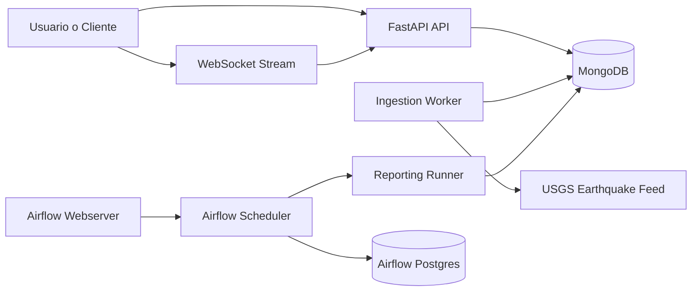
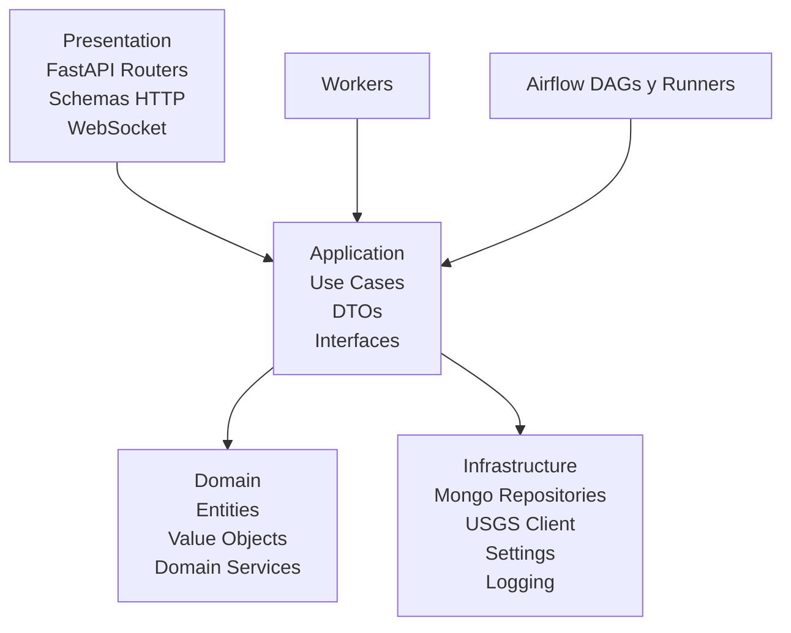
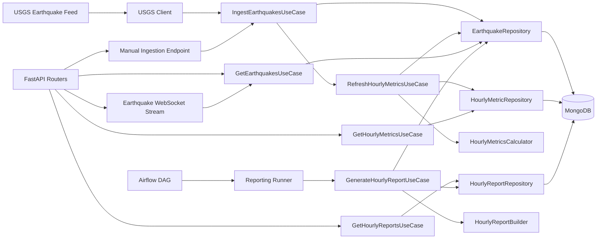

# Arquitectura

## Resumen

La solucion sigue una arquitectura inspirada en `Clean Architecture`, con separacion explicita entre:

- `presentation`: FastAPI, routers, schemas HTTP y dependencias web
- `application`: casos de uso, DTOs y orquestacion del negocio
- `domain`: entidades, value objects y servicios de dominio
- `infrastructure`: MongoDB, cliente USGS, configuracion, logging y contenedor
- `workers`: procesos batch y periodicos desacoplados de FastAPI
- `airflow`: orquestacion horaria sin logica de negocio embebida
- `stream`: canal WebSocket para actualizacion near real-time de eventos sismicos

## Diagrama De Servicios

## Diagrama De Capas

## Diagrama De Flujo Aplicativo

## Principios Aplicados

- Los `routers` nunca acceden directamente a MongoDB.
- Los casos de uso no conocen FastAPI ni Airflow.
- Los repositorios no contienen reglas de negocio.
- Los servicios de dominio concentran la logica de agregacion y consolidacion.
- Airflow solo orquesta la ejecucion de runners/casos de uso.
- El stream WebSocket reutiliza los casos de uso existentes y no introduce acceso directo a infraestructura desde presentacion.

## Actualizacion En Tiempo Real

- El endpoint `ws://localhost:8000/api/v1/stream/earthquakes` expone un canal para clientes que necesiten seguimiento en tiempo real.
- El stream envia un `initial_snapshot` al conectarse y luego publica `earthquake_events` cuando detecta nuevos sismos.
- La implementacion reutiliza `GetEarthquakesUseCase` para mantener consistencia con la capa de aplicacion.
- El canal comparte el mismo puerto de la API, por lo que no requiere servicios extra en Docker.

## Topologia de Ejecucion

- `api`: expone endpoints REST y el trigger manual de ingesta.
- `api`: tambien expone el canal WebSocket de sismos en tiempo real.
- `ingestion-worker`: consulta USGS periodicamente y refresca metricas.
- `airflow-scheduler` y `airflow-webserver`: orquestan y visualizan la generacion de reportes.
- `mongodb`: almacena eventos, metricas y reportes.
- `airflow-postgres`: almacena metadata interna de Airflow.

## Propuesta Analitica 8.4

La plataforma actual implementa la capa operacional. La siguiente propuesta describe como evolucionar hacia una arquitectura de datos orientada a analitica avanzada y Machine Learning sin acoplar esas capacidades al dominio actual.

### Separacion de capas

- **Transaccional / operacional**:
  - `MongoDB` para eventos, metricas y reportes operativos
  - `FastAPI`, `workers` y `WebSocket` consumen esta capa
- **Analitica**:
  - procesos orquestados por `Airflow`
  - materializacion incremental en `Parquet`
  - datasets curados para consumo historico y entrenamiento de modelos
- **Serving analitico**:
  - una capa futura orientada a dashboards historicos y consultas analiticas
  - desacoplada de la API operacional

### Flujo propuesto

1. `ingestion-worker` persiste eventos nuevos en la capa transaccional
2. `Airflow` ejecuta extracciones incrementales por ventana temporal
3. los eventos se exportan a una `raw zone` en `Parquet`
4. jobs posteriores generan una `curated zone` con agregados, features y datasets
5. dashboards historicos y cargas de entrenamiento consumen la capa analitica

### Cobertura del requerimiento

- **Dashboards historicos**:
  - se apoyarian en la capa analitica y en agregados curados
- **Dashboards en tiempo real**:
  - pueden consumir el `WebSocket` actual para eventos nuevos
- **Datasets para ML**:
  - se generarian como salidas versionadas de `Airflow`
- **Parquet near real-time**:
  - se propone exportacion incremental por particiones temporales
- **Separacion transaccional/analitica**:
  - ya esta prevista a nivel de arquitectura
- **Historico de gran volumen**:
  - se recomienda almacenamiento particionado y de menor costo para retencion de largo plazo

### Estado actual frente a la propuesta

- implementado hoy:
  - capa transaccional operativa
  - agregados horarios
  - stream WebSocket near real-time
  - orquestacion base con Airflow
- no implementado aun:
  - data lake
  - exportacion a `Parquet`
  - dashboards
  - datasets de entrenamiento
  - storage historico especializado
